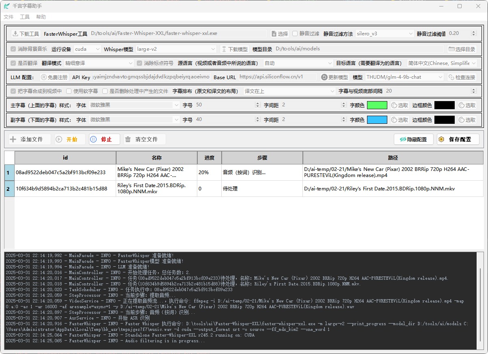

<p align="center"></p>
<h2 align="center">千言字幕助手</h2>
<h3 align="center">基于 LLM 大语言模型的字幕翻译和生成工具</h3>
<p align="center">
  <a href="https://www.gnu.org/licenses/gpl-3.0.html#license-text">License: GPL v3</a>
</p>
<hr/>

**千言字幕助手**（LiteSubtitler）是一款基于大语言模型(LLM)的视频字幕处理助手，语音识别、断句、翻译、合成一键式处理，操作简单，配置要求低，可以应用于学习、观影、视频制作等场景。
 
- **🚀 一键式字幕处理**：语音识别、断句、翻译、合成，全部流程一键搞定！
- **💻 开箱即用，配置无忧**：内置基础工具与模型，无需繁琐配置，下载解压即可上手使用！真正的即插即用，让技术门槛降到冰点！
- **📡 离线应用**：支持本机离线处理，基于强大的Ollama大模型进行翻译，无需网络也能轻松应对各种字幕需求！
- **🌐 模型中立，兼容广泛**：无论是本地私有大模型还是国内外公共大模型，都能完美对接，让你的字幕处理更加灵活多样！
- **💰 免费使用，开源共享**：完全免费使用，并开放源代码，欢迎各位开发者共同贡献与优化！
- **🎥 批量处理，高效便捷**：支持批量视频字幕生成，无需人工值守，系统自动完成所有工作！让你的视频制作效率翻倍！
- **🌐 多语言支持，沟通无界**：支持上百种源视频语言识别与多种目标语言翻译，让你的视频作品跨越语言障碍，走向世界！
 
## 📖1、快速开始

- **下载Window压缩包**: 解压后就可以使用；
   - Gitee:  [Window缩包（LiteSubtitler-window-XXX.zip）](https://gitee.com/tobinwu/LiteSubtitler/releases)
   - Github: [Window压缩包（LiteSubtitler-window-XXX.zip 或者 LiteSubtitler-window-XXX-full.7z）](https://github.com/Tobin-wu/LiteRecorder/releases)
- **第一次使用**: 建议下载 -full.7z 版本，-full.7z 文件中打包了 FasterWhisper工具 和 small 模型，而对应的zip文件则不包括FasterWhisper工具和模型；
- - **解压**: -full.7z 文件后，运行其中的 LiteSubtitler.exe 就可以；
- **升级**: 只是要下载对应版本的 ZIP文件，解压后覆盖对应文件即可；
- **编译运行**: 可以下载源代码然后自己编译运行；
- **更多问题**: 可以加入字幕助手使用群与我们交流；如果对相关AI技术感兴趣，可以加入AI技术交流群。
- ⬇️⬇️⬇️⬇️⬇️⬇️
- **字幕助手使用群**

<image height="201px" width="201px" src="docs/使用群.png"/>
                                         
- **AI技术交流群**

<image height="201px" width="201px" src="docs/技术群.png"/>

## 📂2、安装后的目录结构

- 假设解压在 D:\tools\ai 目录，并且已经成功运行过（有些目录和文件是运行后生成的）。 

```
   📁 D:\tools\ai
       ├── 📄 LiteSubtitler.exe       # 应用程序
       ├── 📄 setting.json            # 配置文件
       ├── 📂 AppData
       │   └── 📂logs
       │       └── 📄 app.log         # 运行日志
       ├── 📂 Faster-Whisper-XXL      # faster-whisper工具     
       │   ├── 📄 faster-whisper-xxl.exe
       │   ├── 📄 ffmpeg.exe
       │   ├── 📄 license.txt
       │   ├── 📄 One Click Transcribe.bat
       │   └── 📂 _xxl_data
       ├── 📂 models
       │   └── 📂 faster-whisper-small   # small模型
       └── 📂 resources
           ├── 📂 images       # 使用的图片资源
           ├── 📂 prompts      # 提示语目录
           └── 📂 styles       # 全局样式
```

## 📺3、UI 展示
- 主界面
<table style="border-collapse: collapse; border: 1px solid black;">
  <tr>
    <td style="padding: 5px;background-color:#fff;"></td>
  </tr>
</table>

- AI聊天工具
<table style="border-collapse: collapse; border: 1px solid black;">
  <tr>
    <td style="padding: 5px;background-color:#fff;"></td>
  </tr>
</table>

- AI翻译工具
<table style="border-collapse: collapse; border: 1px solid black;">
  <tr>
    <td style="padding: 5px;background-color:#fff;"></td>
  </tr>
</table>

## ♊4、UI说明

### 4.1、FasterWhisper配置

FasterWhisper用于做语音转文字处理。

- **下载工具**: 可选功能，如果用 -full.7z 解压安装的，就不需要下载工具了；否则，在打开的网页中下载对应的版本的Faster-Whisper工具，然后解压待用。
- **选择FasterWhisper工具**: 选择下载解压时的Faster-Whisper工具（faster-whisper-xxl.exe）。
- **FasterWhisper静音过滤**: 用于过滤静音，减少幻听，但使用这个功能可能会导致字幕时间轴错乱，所以如果能不用尽量不用。
- **静音过滤方法**: 用于过滤静音的模式，不同方法的区别请查阅 Faster-Whisper VAD 的相关资料。
- **静音过滤阈值**: 多大的声音被定义为静音。
- **消除背景音乐**: 把背景音乐和人声隔离出来，提高识别效果，但可能会有一些人声被误认为是音乐。
- **运行设备**: 指定用 CPU 还是 CUDA（显卡GPU）来进行语音转文字，CUDA比CPU快5倍以上，但需要电脑有GPU的显卡。
- **Whisper模型**: 进行识别使用的模型，模型由小到大排序：small、medium、large-v1、large-v2、large-v3，理论上越大的模型效果越好，但要求的计算资源越大，处理速度越慢。
- **下载模型**: 可以让系统自动下载模型（只要选择某个Whisper模型就可以，运行过程中会下载），也可以手动下载Whisper模型：
   - 1、选择Whisper模型（假设选择的是：large-v2）。
   - 2、建立并指定模型目录（假设目录是：D:\tools\ai\models）。
   - 3、建立所择Whisper模型的子目录(根据上述假设，模型子目录应该是：D:\tools\ai\models\faster-whisper-large-v2)。
   - 4、点击“下载模型”按钮，打开FasterWhisper模型网页，files页中列出的就是faster-whisper-large-v2模型的所有文件，逐个下载并放到D:\tools\ai\models\faster-whisper-large-v2目录中。
   - 5、下载完成的large-v2目录架构应该是：
   ```
   📁 D:\tools\ai\models
       └── 📂 faster-whisper-large-v2
           ├── 📄 README.md
           ├── 📄 config.json
           ├── 📄 model.bin
           ├── 📄 tokenizer.json
           └── 📄 vocabulary.txt
   ```

### 4.2、翻译配置

- **是否翻译**: 有时候只需要语音识别为文字，并不需要进行翻译。
- **翻译模式**: 
   - **模型直译**: 用LLM大模型进行直接翻译，不做限定和要求，都由LLM大模型自己处理。
   - **精细意译**: 要求LLM大模型在直译的基础上根据说话意思进行调整，要求遵守目标语言的习惯和表达。
   - **深思翻译**: 要求LLM大模型校正字幕，在遵守目标语言的习惯和表达的基础上，以专业的角度进行审视和调整，以求翻译结果更加精准。
- **消除标点符号**: 删除字幕中多余的标点符号。
- **源语言**: 视频或者音频中说话所用的语言，可以由系统自动识别（系统会通过音频的前30秒进行自动识别），也可以指定。自动识别支持更多的源语言（不在源语言的下拉列表中）。
- **目标语言**: 系统支持的结果语言，就是需要翻译为的语言，目前支持中文、英语、日语、韩语等十多种。

### 4.3、LLM 配置

- **免费注册**: 注册一个属于你自己的免费LLM账号（硅基流动的LLM云账号），其中有很多免费或者收费模型可以用。在打开的网页上用手机号注册即可。
- **API Key**: 调用LLM大模型进行翻译时使用的API密钥，在上一步“免费注册”中生成的密钥拷贝粘贴过来即可。
   - **生成API密钥**:
   ```
   1、免费注册硅基流动的LLM云账号之后，登录到硅基流动的工作台上。
   2、在“账户管理”中选“API密钥”。
   3、在“API密钥”页面上选择“新增API密钥”，输入密钥描述，然后“新建密钥”即可看到密钥已经生成在列表中。
   4、在列表中点击一下这个密钥，比如：sk-m*******************************************dpmd，就复制成功了。
   5、然后到千言字幕助手的页面上，粘贴到“API Key”后面的编辑框中。
   ```
- **Base URL**: LLM 大模型的地址，硅基流动的URL是：https://api.siliconflow.cn/v1
- **更新模型**: 修改了LLM模型的 API Key 或者 Base URL 之后，需要点击“更新模型”按钮来获取对应的LLM模型。
- **模型**: 可用的LLM模型，翻译使用的模型是“对话”模型（硅基流动的“模型广场”中的“对话”模型），正常情况下收费的“对话”模型都可以用来做翻译。
   - **翻译比较好的免费模型**：
   ```
   THUDM/glm-4-9b-chat
   Qwen/Qwen2.5-7B-Instruct
   THUDM/chatglm3-6b
   ```
- **检查连接**: 验证 API Key、Base URL、模型 是否正确。

### 4.4、字幕配置

- **把字幕合成到视频中**: 是否进行字幕和视频的合成处理。
- **使用软字幕**: 如果使用这个选项，就是快速把字幕附加在视频上，没有真正嵌入到视频文件中，把视频文件拷贝到其他电脑，或者投屏，可能没有字幕显示，另外，源视频已经有字幕的，采用软字幕合成会失败。如果不选用软字幕，就是硬合成，把字幕内容嵌入到视频文件中。
- **是否删除处理中产生的文件**: 处理过程中的中间文件包括：音频文件、识别文字文件，识别合并处理后的字幕文件，翻译后的字幕文件。
- **字幕排布**: 显示在视频上时，原文和译文如何排布。
- **字幕与视频底部的间隔**: 字幕显示在视频图像的什么地方。

### 4.5、主（副）字幕样式配置

- **字体**: 字幕在视频上采用的字体。
- **字号**: 字幕在视频上显示的字体大小。
- **字间距**: 字幕中字和字之间的间隔宽度。
- **字颜色**: 字幕在视频上显示的字体颜色。
- **边框颜色**: 字幕在视频上显示的字体的边框颜色。

### 4.6、操作按钮

- **添加文件**: 添加要处理的文件，支持视频文件、音频文件、字幕文件（要翻译的字幕文件）
- **开始**: 开始对列表中的文件进行处理。
- **停止**: 停止处理，停止命令发出后，将会把当前步骤执行完成才会停止。
- **清空文件**: 清空列表中的文件。
- **隐藏(显示)配置**: 隐藏或者显示上面的配置信息。
- **保存配置**: 把配置信息保存下来。另外，在开始处理时也会保存配置信息。

### 4.7、处理日志

窗口最下面部分是处理日志显示区。

## ♒5、效果

- **处理视频**：Moana.2016.avi（海洋奇缘(2016)）
- **视频时长**：01:47:12
- **电脑配置**：
   - **CPU**：AMD Ryzen 7 2700X，8核16线程
   - **显卡**：RTX3060 Ti，8G
   - **内存**：DDR4，32G
- 助手主要配置：
   - Standalone Faster-Whisper-XXL r245.2
   - **本地 Whisper 模型**: large-v2
   - **运行设备**：cuda
   - **静音过滤**：不选择
   - **消除背景音乐**：选择
   - **翻译模式**：精细意译
   - **源语言**：自动 (俄语)
   - **目标语言**：简体中文
   - **LLM配置**：硅基流动，THUDM/glm-4-9b-chat (免费)
   - **字幕合成**：硬合成到视频文件
- **处理时长**：24:54  
- **LLM费用**：0元（95340 tokens）
- **具体测试数据**：请参考 [海洋奇缘(2016)](docs/demo/Moana.2016.md)

## 🐎6、高级功能

### 6.1、限制可选的 LLM 模型

从API获取到的模型可能很多个，但并不是都适合用于翻译，但都显示在下拉列表中，不方便选择，可以用这个功能来限制下拉列表显示的模型。

- 在配置文件 setting.json 加上如下内容：
```
    "SHOW_MODELS": {
        "enabled": true,
        "models": [
            "THUDM/glm-4-9b-chat",
            "THUDM/chatglm3-6b",
            "deepseek-ai/DeepSeek-V3"
        ]
    },
```
- **enabled**：配置是否生效。
- **models**： 能用的模型。

### 6.2、修改翻译的提示语

- 修改 resources\prompts 目录下的对应文件，其中的[TargetLanguage]不能修改。
   - **摘要.txt**：提取视频摘要的提示语。
   - **翻译-模型直译.txt**：模型直译的提示语。
   - **翻译-精细意译.txt**：精细意译的提示语。
   - **翻译-深思翻译.txt**：深思翻译的提示语。

## 📝7、代码主要说明：

### 7.1、目录结构

```
📁 /LiteSubtitler  
    ├── 📂 docs  
    │   ├── 📄 screen.png  
    │   └── 📂 demo  
    │       └── 📂 Moana.2016
    ├── 📂 resources
    │   ├── 📂 images       # 使用的图片资源
    │   ├── 📂 prompts      # 提示语目录
    │   └── 📂 styles       # 全局样式
    └── 📂 src             
        ├── 📄 main.py      # 主程序入口
        ├── 📄 config.py    # 配置信息      
        ├── 📂 controller   # 控制器
        ├── 📂 core         # 核心处理模块
        │   ├── 📄 base_object.py   # 基类
        │   ├── 📄 work_thread.py   # 工作线程
        │   ├── 📂 asr          # ASR识别处理
        │   ├── 📂 audio        # 音频处理
        │   ├── 📂 llm          # 大模型处理
        │   └── 📂 srt          # 字幕处理
        ├── 📂 enums        # 枚举定义
        ├── 📂 model        # 数据
        ├── 📂 service      # 服务类
        ├── 📂 setting      # 设置
        ├── 📂 task         # 任务处理
        ├── 📂 ui           # 界面
        └── 📂 utils        # 工具
```

### 7.2、程序调用

- 界面-->控制器-->服务-->核心处理
