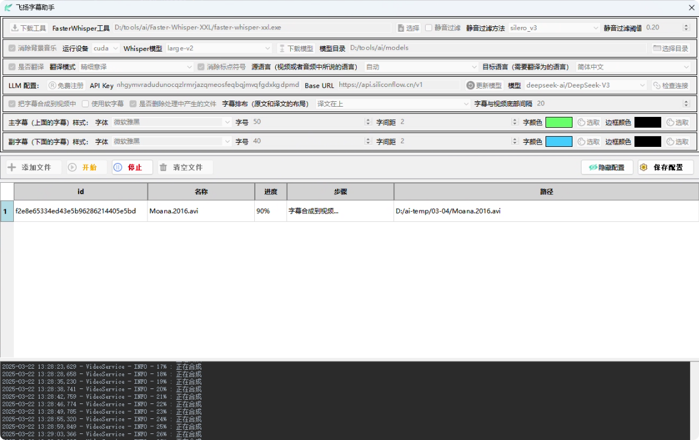
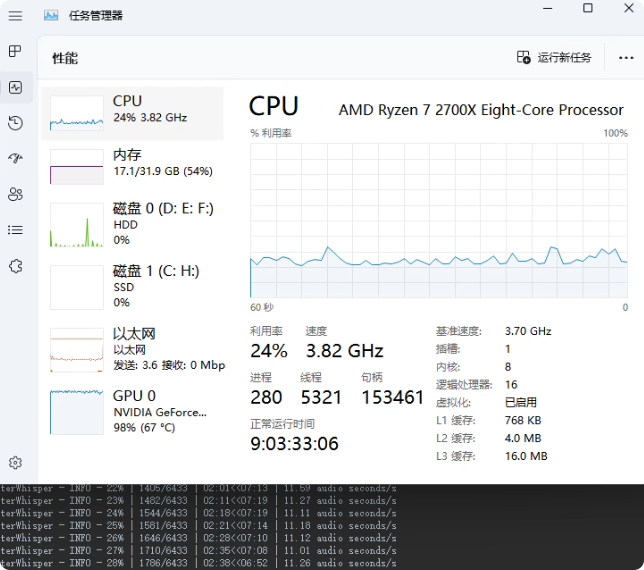
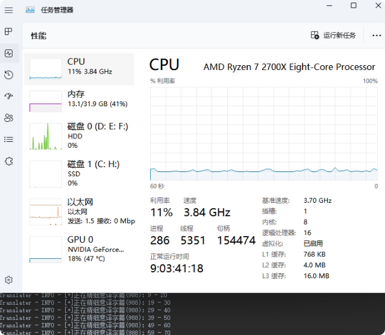
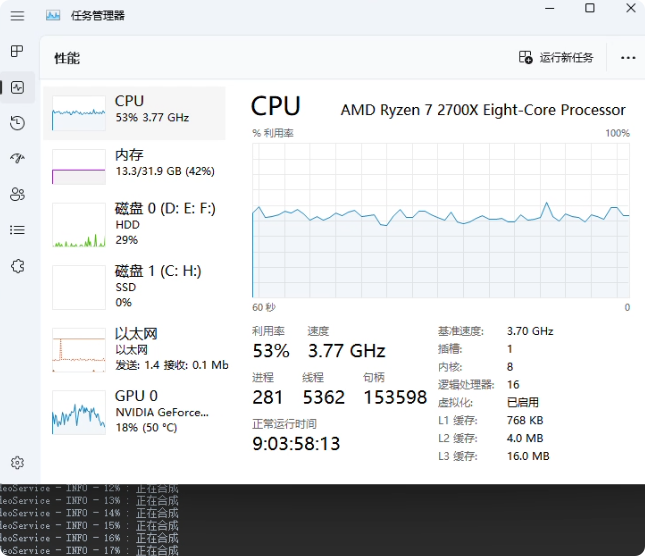
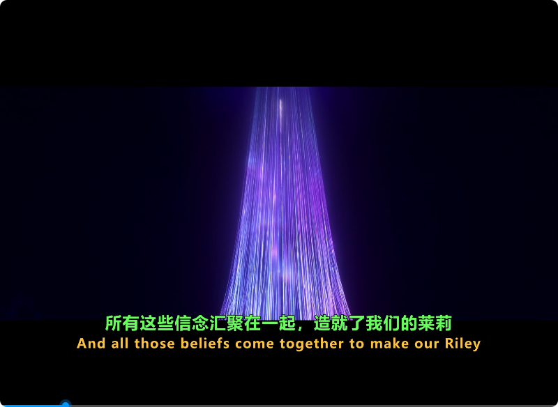

## 效果

- 处理视频：Moana.2016.avi（海洋奇缘(2016)）
- 视频时长：01:47:12
- 电脑配置：
   - CPU：AMD Ryzen 7 2700X，8核16线程
   - 显卡：RTX3060 Ti，8G
   - 内存：DDR4，32G
- 助手主要配置：
   - Standalone Faster-Whisper-XXL r245.2
   - 本地 Whisper 模型: large-v2
   - 运行设备：cuda
   - 静音过滤：不选择
   - 消除背景音乐：选择
   - 翻译模式：精细意译
   - 源语言：自动
   - 目标语言：简体中文
   - LLM配置：硅基流动，deepseek-ai/DeepSeek-V3 (输入：￥2/ M Tokens；输出：￥8/ M Tokens)
   - 字幕合成：硬合成到视频文件
- LLM费用：0.2571元（78459 tokens）
- 处理时长：总时长为 37:51
   - 开始时间：12:56:19
   - Whisper转录完成： 13:09:33
   - 翻译完成：13:27:10
   - 结束时间：13:34:10
   - 转录识别时长: 13:14
   - 翻译时长: 17:37
   - 合成时长: 07:00
- 部分字幕内容：
```
1
00:00:51,040 --> 00:00:59,300
最初，只有一片海洋
В самом начале был только океан

2
00:00:59,680 --> 00:01:03,200
直到岛屿之母出现
пока не появилась мать островов

3
00:01:04,200 --> 00:01:05,440
她就是特菲提
Тефити

4
00:01:06,860 --> 00:01:12,780
她的心脏拥有最伟大的礼物，能够创造生命
Ее сердце обладало величайшим даром, оно могло создавать жизнь

5
00:01:13,500 --> 00:01:17,180
特菲提将这个礼物分享给了世界
и Тефити делилась ею с миром

6
00:01:19,820 --> 00:01:24,700
但后来，有些人开始寻找特菲提的心脏
Но потом некоторые стали искать сердца Тефити

7
00:01:25,040 --> 00:01:29,460
他们相信，只要得到心脏，就能掌握创造的力量
они верили, что завладев сердцем, они завладеют и даром созидания

8
00:01:30,880 --> 00:01:38,300
有一天，他们中最胆大妄为的人穿越了整个海洋
И однажды самый дерзкий из них перелетел через весь океан

9
00:01:38,680 --> 00:01:45,780
只为夺取那颗心脏。他是风与海的半神
чтобы забрать сердце. Это был полубог ветров и морей

10
00:01:47,160 --> 00:01:49,760
他是一名战士
это был воин

11
00:01:51,120 --> 00:01:52,980
多面的捣蛋鬼
многолиткий проказник

12
00:01:54,760 --> 00:02:00,600
他用他的魔法鱼钩改变外貌
Он менял обличие с помощью своего волшебного рыболовного крюка

13
00:02:02,200 --> 00:02:06,880
他的名字叫毛伊
и звали его Мауи

14
00:02:16,750 --> 00:02:20,890
失去了心脏后，特菲提开始崩溃
Лишившись сердца, Тефити начала разрушаться

15
00:02:21,530 --> 00:02:23,710
引发了可怕的黑暗
порождая ужасную тьму

16
00:02:42,950 --> 00:02:44,610
毛伊试图逃跑
Мауи пытался бежать

17
00:02:45,050 --> 00:02:48,410
但另一位心脏猎手挡住了他的去路
но ему преградила путь другая охотница за сердцем

18
00:02:50,650 --> 00:02:51,990
塔卡
Така

19
00:02:52,710 --> 00:02:55,590
大地与火焰的恶魔
Демон земли и огня

20
00:03:03,540 --> 00:03:06,080
毛伊从天上坠落
Мауи был низвергнут с неба

21
00:03:07,000 --> 00:03:08,940
从此再未现身
и больше его не видели
```
- 视频截图：
   - 助手处理界面：
<table style="border-collapse: collapse; border: 1px solid black;">
  <tr>
    <td style="padding: 5px;background-color:#fff;"></td>
  </tr>
</table>  
   - 资源占用--Whisper转录：
<table style="border-collapse: collapse; border: 1px solid black;">
  <tr>
    <td style="padding: 5px;background-color:#fff;"></td>
  </tr>
</table>  
   - 资源占用--翻译：
<table style="border-collapse: collapse; border: 1px solid black;">
  <tr>
    <td style="padding: 5px;background-color:#fff;"></td>
  </tr>
</table>  
   - 资源占用--合成：
<table style="border-collapse: collapse; border: 1px solid black;">
  <tr>
    <td style="padding: 5px;background-color:#fff;"></td>
  </tr>
</table>  
   - 合成后的视频截图：
<table style="border-collapse: collapse; border: 1px solid black;">
  <tr>
    <td style="padding: 5px;background-color:#fff;"></td>
  </tr>
</table>  


